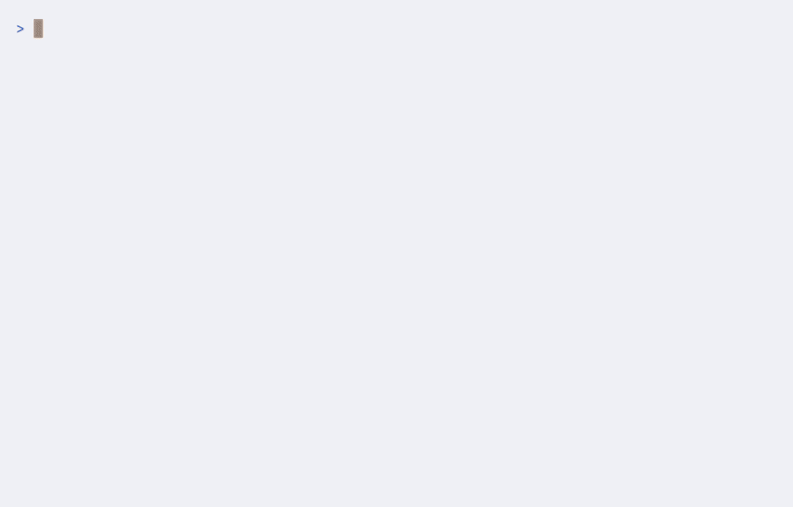

# staze

A terminal time tracker. Start sessions, label them, and review your time as a bar chart — all from the keyboard. 

Let the stars witness your amazing work! 

<p align="center">
  
</p>
<p align="center">
    
    <a href="https://github.com/SimonBure/staze"></a>
</p>


<!-- Demo gif — render with `vhs demo.tape` (https://github.com/charmbracelet/vhs) -->


## Install

### From source (any platform)

```sh
cargo install staze
```

### macOS / Linux (prebuilt binary)

```sh
curl --proto '=https' --tlsv1.2 -LsSf https://github.com/SimonBure/staze/releases/latest/download/staze-installer.sh | sh
```

### Windows (PowerShell)

```powershell
powershell -ExecutionPolicy ByPass -c "irm https://github.com/SimonBure/staze/releases/latest/download/staze-installer.ps1 | iex"
```

Requires no system dependencies (SQLite is bundled).

## Usage

```sh
staze
```

| Key | Action |
|-----|--------|
| `←` `→` / `h` `l` | Navigate menu |
| `↑` `↓` / `k` `j` | Navigate list |
| `Enter` | Select |
| `/` | Search / edit label |
| `Esc` | Cancel / clear filter / back |
| `Q` | Quit |

Vim-style `h` `j` `k` `l` work as aliases for the arrow keys, except while typing a label (use the arrows to pick a suggestion).

### Labels

Label input works the same on every screen: type to get autocomplete suggestions from your existing labels, `↑` `↓` to pick one, `Enter` to confirm, `Esc` to cancel.

- **Session** — `/` (or `Enter` on the label) to label the running session.
- **History** — `/` (or `Enter` on the label row) to filter the chart by label; the chart updates once you confirm. `Esc` clears the filter. `E` exports all sessions to CSV.
- **Tags** — `/` to jump to a tag, `Enter` to rename it (renaming onto an existing tag merges them), `D` to delete it.

Sessions are stored in `~/.local/share/staze/staze.db`.

## Configuration

Optional config at `~/.config/staze/config.toml`:

```toml
db_path = "/custom/path/to/staze.db"

# Written by the Settings screen (Home → Settings)
theme = "dark-blue"      # dark-blue | dark-red | light-blue | light-red
galaxy = true            # rotating galaxy on the home screen
session_stars = true     # twinkling stars and shooting stars during a session
galaxy_arms = 2          # 2–4
galaxy_turn_secs = 240   # one full rotation, 30–600
galaxy_tilt = 0.55       # 0.25 (edge-on) – 1.0 (face-on)
galaxy_winding = 1.6     # how tightly the arms coil, 0.6–3.0
galaxy_sparkle = true    # cells briefly brighten, like the session stars
galaxy_field_stars = true
```

## License

MIT
